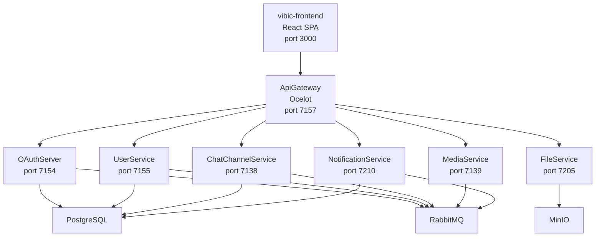

# Vibic Platform

Vibic Platform is a microservice-based communication platform with servers, direct messages, text channels, voice channels, and 1-to-1 audio/video calls. The repository contains the React frontend, the .NET backend services, and the shared libraries used by those services.

## Stack

- .NET 10 / ASP.NET Core
- React 19 + TypeScript + Vite
- SignalR + WebRTC
- PostgreSQL 13
- RabbitMQ
- MinIO

## Repository layout

| Component | Path | Purpose |
|---|---|---|
| Frontend | `src/vibic-frontend` | React SPA for auth, chat, servers, voice, and calls |
| ApiGateway | `src/ApiGateway` | Ocelot gateway used by the frontend |
| OAuthServer | `src/OAuthServer` | Authentication, JWT issuance, and OpenIddict endpoints |
| UserService | `src/UserService` | User profiles, avatars, friends, and presence hub |
| ChatChannelService | `src/ChatChannelService` | Servers, channels, invites, messages, reactions, and chat hub |
| MediaService | `src/MediaService` | Call signaling and voice-channel presence |
| FileService | `src/FileService` | File upload and retrieval backed by MinIO |
| NotificationService | `src/NotificationService` | Push notifications for messages, friend requests, and invites |
| Vibic Libraries | `src/Vibic Libraries` | Source for shared libraries published as `Vibic.Shared.*` packages |

## Architecture



Containerized development uses one PostgreSQL instance and separates service data with schemas (`oauth`, `users`, `chat`, and `notifications`). The local example configs use dedicated database names for readability.

## Gateway routes

| Upstream route | Destination |
|---|---|
| `/auth/sign-in` | OAuthServer |
| `/auth/sign-up` | OAuthServer |
| `/servers/*` | ChatChannelService |
| `/channels/*` | ChatChannelService |
| `/messages/*` | ChatChannelService |
| `/invites/*` | ChatChannelService |
| `/user-profiles/*` | UserService |
| `/friends*` | UserService |
| `/files/*` | FileService |
| `/notifications/*` | NotificationService |
| `/hubs/chat` | ChatChannelService |
| `/hubs/call` | MediaService |
| `/hubs/presence` | UserService |
| `/hubs/notifications` | NotificationService |

## Prerequisites

- Docker + Docker Compose for the full containerized stack
- .NET 10 SDK for local backend work
- Node.js 22+ for local frontend work
- A GitHub Personal Access Token with `read:packages` scope

Backend services restore `Vibic.Shared.*` packages (`Vibic.Shared.Core`, `Vibic.Shared.EF`, `Vibic.Shared.Messaging` — version 10.0.2) from GitHub Packages at `https://nuget.pkg.github.com/VorobevEmil/index.json`.

## Running with Docker

1. Copy the environment template:

```bash
cp .env.example .env
```

2. Set your GitHub Packages token in `.env`:

```env
NUGET_GITHUB_TOKEN=ghp_your_github_personal_access_token
```

3. Start the full stack:

```bash
docker compose up --build
```

Notes:

- `ApiGateway` switches to `ocelot.Docker.json` through `ASPNETCORE_ENVIRONMENT=Docker`.
- Docker mounts service configs from `configs/` for each backend service.

### Available URLs

| Service | URL |
|---|---|
| Frontend | http://localhost:3000 |
| ApiGateway | http://localhost:7157 |
| OAuthServer | http://localhost:7154 |
| UserService | http://localhost:7155 |
| ChatChannelService | http://localhost:7138 |
| MediaService | http://localhost:7139 |
| FileService | http://localhost:7205 |
| NotificationService | http://localhost:7210 |
| RabbitMQ UI | http://localhost:15672 |
| MinIO Console | http://localhost:9001 |

Default credentials:

- RabbitMQ: `rabbitmq` / `rabbitmq`
- MinIO: `admin` / `admin12345`
- PostgreSQL: `postgres` / `postgres`

## Running locally

1. Start the infrastructure services:

```bash
docker compose up postgres rabbitmq minio
```

2. Add the GitHub Packages feed:

```bash
dotnet nuget add source "https://nuget.pkg.github.com/VorobevEmil/index.json" \
  --name github \
  --username VorobevEmil \
  --password "<YOUR_GITHUB_PAT>" \
  --store-password-in-clear-text
```

3. Create `appsettings.json` for each backend service from its `appsettings.example.json`.

4. Start the backend services:

```bash
dotnet run --project src/OAuthServer/src/OAuthServer.Web
dotnet run --project src/UserService/src/UserService.Web
dotnet run --project src/ChatChannelService/src/ChatChannelService.Web
dotnet run --project src/FileService/src/FileService.Web
dotnet run --project src/MediaService/src/MediaService.Web
dotnet run --project src/NotificationService/src/NotificationService.Web
dotnet run --project src/ApiGateway/src/ApiGateway.Web
```

5. Start the frontend:

```bash
cd src/vibic-frontend
npm install
npm run dev
```

The frontend uses `VITE_API_BASE_URL`, which defaults to `http://localhost:7157`.

## Ports

| Service | Port |
|---|---|
| Frontend (Docker) | 3000 |
| ApiGateway | 7157 |
| OAuthServer | 7154 |
| UserService | 7155 |
| ChatChannelService | 7138 |
| MediaService | 7139 |
| FileService | 7205 |
| NotificationService | 7210 |
| PostgreSQL | 5432 |
| RabbitMQ (AMQP) | 5672 |
| RabbitMQ (UI) | 15672 |
| MinIO API | 9000 |
| MinIO Console | 9001 |

## Shared libraries

The repository includes the source for three shared libraries under `src/Vibic Libraries`. Services consume them as NuGet packages (version 10.0.2) restored from GitHub Packages:

| Package | Purpose |
|---|---|
| `Vibic.Shared.Core` | Authentication helpers, options binding, exception handling, telemetry, health helpers |
| `Vibic.Shared.EF` | Shared EF Core primitives, unit of work, and outbox support |
| `Vibic.Shared.Messaging` | RabbitMQ / messaging setup and shared event contracts |
