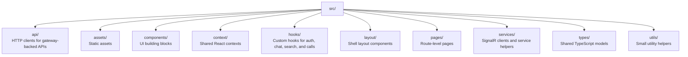

# Vibic Frontend

The Vibic frontend is a React single-page application for authentication, direct messages, servers, voice channels, and 1-to-1 calls.

## Features

- Sign up and sign in flows
- Direct-message channels with real-time updates
- Servers with text channels and voice channels
- Emoji reactions on messages with real-time sync
- In-app notification panel with unread badge
- Accept or reject friend requests directly from the notification panel
- 1-to-1 audio/video calls with microphone and camera controls
- Incoming call modal with ringtone playback
- Friend discovery and request management
- Invite-based server joins
- Avatar updates and user search
- Cursor-based message history loading

## Stack

| Technology | Role |
|---|---|
| React 19 | UI |
| TypeScript 5 | Typing |
| Vite 6 | Dev server and build tool |
| Tailwind CSS 3 | Styling |
| React Router DOM 7 | Routing |
| SignalR | Real-time backend communication |
| WebRTC | Peer-to-peer audio and video |
| Axios | HTTP client |
| Lucide React | Icons |

## Project structure



## Environment

Create `src/vibic-frontend/.env.local` when running locally:

```env
VITE_API_BASE_URL=http://localhost:7157
```

The app falls back to `http://localhost:7157` if the variable is not set.

## Run

Docker:

- Included in `docker compose up --build`
- Served by Nginx on http://localhost:3000
- Built with a multi-stage image using `node:22-alpine`

Local:

```bash
cd src/vibic-frontend
npm install
npm run dev
```

## Build and lint

```bash
npm run build
npm run preview
npm run lint
```
